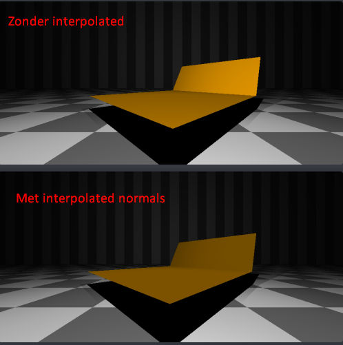

#Ray Tracer 18

## Objecten
- Driehoeken 
- Spheres 
- Planes 
- Box 

## Basis Onderdelen (60%)
#### Camera([`Camera`](./RayTracer/src/RayTracer18/Camera.java))
#### Schermvlak([`Camera`](./RayTracer/src/RayTracer18/Camera.java))
#### Aantal primitieve objecten([`Primitives/*`](./RayTracer/src/RayTracer18/Primitives))
#### Lichtbronnen([`Lights/*`](./RayTracer/src/RayTracer18/Lights))
#### Renderer ([`Renderer`](./RayTracer/src/RayTracer18/Renderer.java))
#### Interface/Debugger ([`Customizer`](./RayTracer/src/RayTracer18/Customizer.java) & [`Main`](./RayTracer/src/RayTracer18/Main.java))

## Bonus Onderdelen (40%)
#### ⭐Driehoeken ([`Primitives/Triangle`](./RayTracer/src/RayTracer18/Primitives/Triangle.java))
Möller–Trumbore intersection algorithme. Schrijft ook de uv waardes op.
#### ⭐OBJ importer ([`Primitives/ObjLoader`](./RayTracer/src/RayTracer18/Primitives/ObjLoader.java))
Leest een `.obj` bestand en maakt driehoeken aan van alle faces.
Als er quads in het bestand zitten zet hij ze om naar 2 driehoeken.
#### ⭐Smooth Shading/Normal interpolation ([`Primives/Triangle#getNormalAt`](./RayTracer/src/RayTracer18/Primitives/Triangle.java))
Gebruikt de vertex normals uit `.obj` file bij het opvragen van normal gebruikt
hij de baycentric waarden(uv coördinaten) van het snijpunt om de normaal te berekenen. 

#### ⭐Textures/UV Maps([`Triangle#getColorAt`](./RayTracer/src/RayTracer18/Primitives/Triangle.java))
Gebruikt de UV maps uit het `.obj` bestand samen met de uv waarden uit het snijpunt(`Triangle#calculateIntersection`) om de driehoek textuur te geven.

#### ⭐Multithreading([`Renderer`](./RayTracer/src/RayTracer18/Renderer.java))
Gebruikt alle threads die het huidige systeem heeft om de scene te renderen.
Hij verdeeld de canvas in vertical delen voor elke thread om te renderer.
Bij elke UI update(`Renderer extends AnimationTimer`) worden de berekende pixels geschreven.

#### ⭐Hierachy met customizations([`Customizer`](./RayTracer/src/RayTracer18/Customizer.java))
In de hierachy kun je waardes van objecten en lichten aanpassen.
Dit zijn dingen als kleur, positie en rotatie bijvoorbeeld.
Selecteer een object/licht in de hierachy en dan kun je de waardes aanpassen, klik dan op apply om de scene te re-renderen.

###Setup
Hoe run je dit